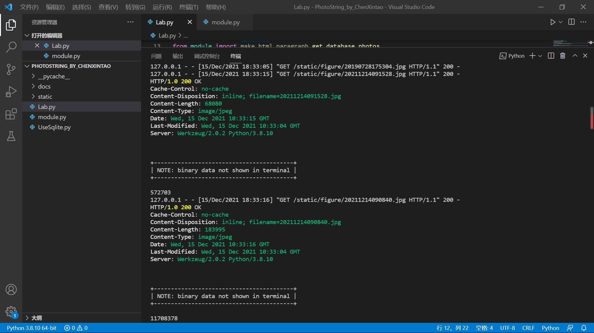

.. photobp documentation master file, created by
   sphinx-quickstart on Sun Dec  5 16:00:14 2021.
   You can adapt this file completely to your liking, but it should at least
   contain the root `toctree` directive.

**Lab 2**: Use blueprints to architect a web application
=================================================

.. toctree::
   :maxdepth: 2
   :caption: Contents:

**小组成员**

201932110105沈音棋

201932110104马奕琪

201932110106孙仪杰

201932110107田西芷

**项目GitHub地址**: `BP Photo`_.

.. _BP Photo: 

**项目Read the Doc地址**: `Read the Doc`_.

.. _Read The Doc: https://bpphoto.readthedocs.io/en/latest/

**项目演示视频地址**: `video`_.

.. _video: https://bpphoto.readthedocs.io/en/latest/

Abstract
=================================================

使用蓝图来组织一个web应用程序。

Introduction
=================================================

Photo String是一个用于存储照片的web相册，允许我们上传图像并为该图像添加描述。

本实验通过蓝图将upload_bp、show_bp、search_bp和api_bp添加到项目中。

upload_bp蓝图允许上传一个新的照片。关联的路由为/upload。

show_bp蓝图允许按时间顺序显示所有照片及其描述。关联的路由为/show。

search_bp蓝图允许过滤照片根据他们的描述。关联的路由为/search/query-string。只有描述与查询字符串匹配的照片才会作为搜索结果返回。可以通过模糊搜索进行查找。

api_bp蓝图允许我们从命令行获得JSON格式的所有照片信息。HTTPie是一个有用的API测试工具。关联的路由是/api/json。返回的json字符串必须包含照片ID，上传日期，照片大小(以KB为单位)和照片描述。

Methods and materials
=================================================

①blueprint: Blueprint是一个存储视图方法的容器，这些操作在这个Blueprint 被注册到一个应用之后就可以被调用，Flask 可以通过Blueprint来组织URL以及处理请求。

Flask使用Blueprint让应用实现模块化，在Flask中，Blueprint具有如下属性：

1.一个项目可以具有多个Blueprint

2.可以将一个Blueprint注册到任何一个未使用的URL下比如 “/”、“/sample”或者子域名

3.在一个应用中，一个模块可以注册多次

4.Blueprint可以单独具有自己的模板、静态文件或者其它的通用操作方法，它并不是必须要实现应用的视图和函数的

5.在一个应用初始化时，就应该要注册需要使用的Blueprint

但是一个Blueprint并不是一个完整的应用，它不能独立于应用运行，而必须要注册到某一个应用中。

②HTTPie:HTTPie 是一个 HTTP 的命令行客户端，目标是让 CLI 和 web 服务之间的交互尽可能的人性化。这个工具提供了简洁的 http 命令，允许通过自然的语法发送任意 HTTP 请求数据，展示色彩化的输出。HTTPie 可用于与 HTTP 服务器做测试、调试和常规交互。

Results
=================================================

**lab.py**
::
      # -*- coding: utf-8 -*-
      """
      Created on Mon Jun  3 15:42:51 2019

      @author: Administrator
      """

      from flask import Flask, request
      from UseSqlite import InsertQuery, RiskQuery
      from datetime import datetime
      from PIL import Image
      from module import bpModule
      from module import make_html_paragraph,get_database_photos

      app=Flask(__name__)
      app.register_blueprint(bpModule,ure_prefix='/bpModule')

      @app.route('/',methods=['POST','GET'])
      def main():
          if request.method=='POST':
              uploaded_file=request.files['file']
              time_str=datetime.now().strftime('%Y%m%d%H%M%S')
              new_filename=time_str+'.jpg'
              uploaded_file.save('./static/upload/'+new_filename)
              time_info=datetime.now().strftime('%Y-%m-%d %H:%M:%S')
              description=request.form['description']
              path='./static/upload/'+new_filename
              iq=InsertQuery('./static/RiskDB.db')
              iq.instructions("INSERT INTO photo Values('%s','%s','%s','%s')"%(time_info,description,path,new_filename))
              iq.do()
              return '
You have uploaded %s.  <a href="/">Return</a>.'%(uploaded_file.filename)
          else:
              page='''<form action="/"method="post"enctype="multipart/form-data">
              <input type="file"name="file"><input name="description"><input type="submit"value="Upload"></form>'''
              page+=get_database_photos()
              return page

      if __name__=='__main__':
          app.run(debug=True)

**module.py**
::
      # -*- coding: utf-8 -*-

      from flask import Blueprint,request
      from UseSqlite import InsertQuery,RiskQuery
      from PIL import Image
      from datetime import datetime
      import os

      bpModule = Blueprint('bpModule',__name__)

      def make_html_paragraph(s):
          if s.strip()=='':
              return ''
          lst=s.split(',')
          picture_path=lst[2].strip()
          picture_name=lst[3].strip()
          im = Image.open(picture_path)
          im.thumbnail((400, 300))
          im.save('./static/figure/'+picture_name, 'png')
          result='
'
          result+='<i>%s</i> '%(lst[0])
          result+='<i>%s</i> '%(lst[1])
          result+=''%(picture_path,picture_name)
          return result+'
'

      #通过关键字查找图片
      def serach_database_photos(photoname):
          rq=RiskQuery('./static/RiskDB.db')
          rq.instructions("SELECT * FROM photo where description like'%%%%%s%%%%'" %photoname)
          rq.do()
          record='
My search photo
'
          for r in rq.format_results().split('\n\n'):
              record+='%s'%(make_html_paragraph(r))
          return record+'</table>\n'

      #在数据库中获取图片
      def get_database_photos():
          rq=RiskQuery('./static/RiskDB.db')
          rq.instructions("SELECT * FROM photo ORDER By time desc")
          rq.do()
          record='
My past photo
'
          for r in rq.format_results().split('\n\n'):
              record+='%s'%(make_html_paragraph(r))
          return record+'</table>\n'

      #搜索蓝图
      @bpModule.route("/search/<photoname>")
      def search_pb(photoname):
          page=''' '''
          page+=serach_database_photos(photoname)
          return page

      #上传蓝图
      @bpModule.route("/upload",methods=['POST','GET'])
      def upload_pb():
          if request.method=='POST':
              uploaded_file=request.files['file']
              time_str=datetime.now().strftime('%Y%m%d%H%M%S')
              new_filename=time_str+'.jpg'
              uploaded_file.save('./static/upload/'+new_filename)
              time_info=datetime.now().strftime('%Y-%m-%d %H:%M:%S')
              description=request.form['description']
              path='./static/upload/'+new_filename
              iq=InsertQuery('./static/RiskDB.db')
              iq.instructions("INSERT INTO photo Values('%s','%s','%s','%s')"%(time_info,description,path,new_filename))
              iq.do()
              return '
You have uploaded %s.  <a href="/">Return</a>.'%(uploaded_file.filename)

          else:
              page='''<form action="/"method="post"enctype="multipart/form-data">
              <input type="file"name="file"><input name="description"><input type="submit"value="Upload"></form>'''
              return page

      #显示图片蓝图
      @bpModule.route("/show")
      def show_pb():
          page=get_database_photos()
          return page

      #从命令行获取所有照片信息
      @bpModule.route("/api/json")
      def api_pb():
          rq=RiskQuery('./static/RiskDB.db')
          rq.instructions("SELECT * FROM photo ORDER By time desc")
          rq.do()
          result = str()
          result="<h1>照片信息</h1>\n\n"
          for r in rq.format_results().split('\n\n'):
              if r.strip()=='':
                  return ''
              lst=r.split(',')
              picture_path=lst[2].strip()
              picture_name=lst[3].strip()
              ret = "http http://127.0.0.1:5000/static/figure/" + picture_name
              os.system(ret)
              res = os.path.getsize(picture_path)
              print("size:" + res)
          return result
        

**/search/**

**/show**

**/upload**

**api_bp**

=================================================

